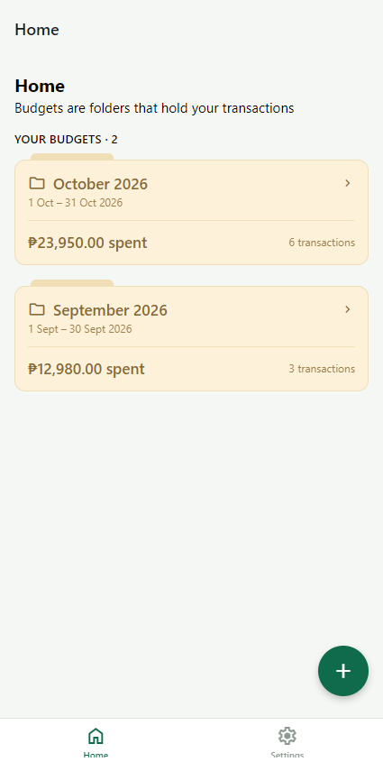
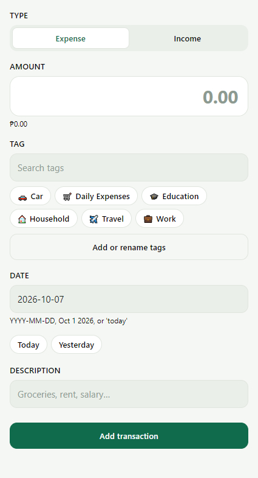
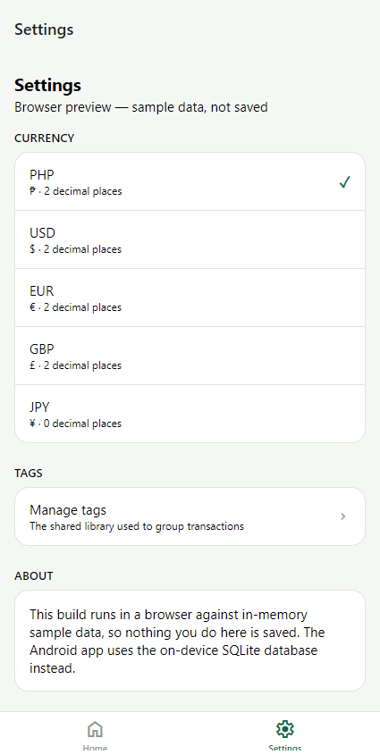

# MoneyQ

A mobile-first, offline personal budgeting app built with Expo and React Native. MoneyQ organises your money into **budgets as period containers** (for example, “October 2026”) and tracks income and expenses inside them, grouped by a shared **tag** library — with no backend, no account, and no data ever leaving the device.

MoneyQ is an evolving project under active development.

## Screenshots

| Home | Budget detail |
| --- | --- |
|  |  |

| Add transaction | Settings |
| --- | --- |
|  |  |

Screenshots are captured from the browser preview (`npm run web`) against seeded sample data.

## Features

- **Budgets as period containers** — create, edit and delete named budgets with a start and end date. A budget has no spending limit; “spent” and “remaining” are always derived from the transactions recorded inside it.
- **Period shortcuts** — “Last month”, “This month” and “Next month” chips pre-fill the budget name and date range on the new-budget form.
- **Transactions** — record income and expenses (amount, date, tag, description) inside a budget. Rows are grouped by day with “Today”/“Yesterday” labels; entries can be deleted with confirmation.
- **Tags instead of budget categories** — one global tag library reused by every budget, seeded with six defaults (Household, Car, Daily Expenses, Work, Travel, Education). Add, rename, recolour and delete tags; deleting a tag keeps its transactions and only clears the tag reference (`ON DELETE SET NULL`).
- **Spending analysis per budget** — remaining balance, income, expense and transaction count summary, plus a per-tag spend breakdown with tap-to-filter on the transaction list.
- **Multi-currency display** — PHP (default), USD, EUR, GBP and JPY; the display currency is a persisted setting. All money is stored as integer minor units so no floating-point rounding can corrupt a balance.
- **Local persistence** — on-device SQLite (`expo-sqlite`) with versioned migrations and WAL mode. Works fully offline.
- **Web preview harness** — the browser build runs the same screens and stores against a seeded in-memory adapter (sample data, nothing saved), so UI/UX work needs no device.
- **Account/transfer model in the schema** — `accounts` exist and transfers are modelled so they never count as income or expenses and leave total assets unchanged; there is no transfer or account form in the UI yet.

## Tech Stack

| Layer            | Technology                                                                                   |
| ---------------- | -------------------------------------------------------------------------------------------- |
| Framework        | Expo SDK 57 (`expo ~57.0.26`), React Native 0.86.3, React 19.2.3                             |
| Routing          | Expo Router ~57 (file-based, routes in `app/`)                                               |
| State            | Zustand ^5 (cache only, no persistence middleware)                                           |
| Storage (native) | `expo-sqlite ~57.0.3` (SQLite, WAL)                                                          |
| Storage (web)    | In-memory adapter (`memoryAdapter.js`), no SQL in the bundle                                 |
| Styling          | React Native `StyleSheet` + theme provider (no NativeWind/Tailwind)                          |
| Icons            | `expo-symbols` via `components/ui/Icon.jsx` (not `@expo/vector-icons`)                       |
| Animation        | `react-native-reanimated` 4.5.1                                                              |
| Language         | JavaScript + ESM only (no TypeScript)                                                        |
| Tooling          | Metro bundler, ESLint (`eslint-config-expo`), Node `node:sqlite` verification scripts        |
| Testing          | `npm run verify:db` — schema, financial-rule and adapter-parity checks (no Jest/test runner) |
| Build            | EAS Build / EAS Update (cloud builds via `npx eas-cli@latest`)                               |

## Architecture

Data flow is strictly one-directional. Only stores import repositories; screens never touch storage directly.

```text
UI (app/, components/)
 ↓
Zustand stores (cache, re-reads on focus)
 ↓
Repositories (business rules: validation, uniqueness, defaults)
 ↓
Storage adapter (platform-resolved import)
 ├─ native: SQLite (expo-sqlite, migrations)
 └─ web: in-memory harness (seeded sample data)
```

`app/_layout.jsx` mounts a `DatabaseGate` that awaits `initStorage()` before rendering anything, so no screen sees a half-initialised store.

### Directory responsibilities

```text
app/                 Expo Router screens (every file is a route)
  (tabs)/            Home + Settings tab navigator
  budget/            Budget detail [id].jsx and create/edit form
  transaction/form    Add-transaction modal
  tags/              Shared tag library manager
components/
  ui/                Primitives: Button, Card, Chip, TextField, Icon, Fab, Screen…
  budgets/           BudgetCard
  tags/              TagForm, TagSpendRow, TagBadge
  transactions/      TransactionRow
stores/              Zustand stores: app, budgets, budgetDetail, tags, settings
storage/
  adapters/          adapter.js (native) / adapter.web.js (web), sqliteAdapter.js,
                     memoryAdapter.js — the only place SQL/table state lives
  database/          database.js (open + migrate) and migrations/
  repositories/      budget, tag, transaction, settings — own the rules
constants/           finance.js (tag/type constants), colors.js
utils/               currency, dates, calculations, id, color
scripts/             verify-schema.mjs + loader (npm run verify:db)
docs/                Original AI project kickoff plan
```

Key rule: all SQL lives in `sqliteAdapter.js`; all table state lives in `memoryAdapter.js`. Both implement the same async interface, so repositories, stores and screens are shared verbatim across platforms.

## Data Model

```text
Budget (period container: name, start_date, end_date — no limit column)
 ├── Transactions (income | expense | transfer, amount in minor units, date)
 │     └── Tag (optional, shared library, ON DELETE SET NULL)
 └── (Accounts table exists; transfers reference source/destination accounts)

Tag   — one global library reused by every budget (name UNIQUE, emoji, color)
Settings — key/value pairs in SQLite (currently: currency)
```

Important fields and constraints (enforced in `storage/database/migrations/001_initial.js`):

- `transactions.type` CHECKed to `income | expense | transfer`; `amount` must be `> 0`.
- A transfer must have distinct `account_id` and `to_account_id`; income/expense must not have a destination.
- `budget_id NOT NULL` — every transaction belongs to a budget; deleting a budget cascades to its transactions.
- Money is stored as **integer minor units** (e.g. centavos); formatting happens only at the display edge via `utils/currency.js`.

## Installation

1. **Prerequisites**: Node.js 20+ and npm. For device testing, the Expo Go app on Android or iOS (Android is the primary target).
2. **Install dependencies**:

   ```bash
   npm install
   ```

3. **Environment configuration**: none required. The app is fully local — there are no environment variables, API keys or `.env` files.
4. **Database setup**: none required. SQLite is created and migrated automatically on first launch (`moneyq.db`); the web build uses an in-memory adapter seeded with demo data.

## Development

```bash
npm start          # expo start — dev server
npm run android    # expo start --android (Android Expo Go, primary target)
npm run ios        # expo start --ios
npm run web        # expo start --web (browser harness for UI/UX work)
npm run lint       # ESLint (eslint-config-expo)
```

Install packages with `npx expo install <package>` so versions match the SDK.

## Testing

There is no unit/E2E test runner. The project’s verification suite is:

```bash
npm run verify:db
```

This runs `scripts/verify-schema.mjs` under Node’s built-in `node:sqlite` and checks:

- the migration schema (tables, constraints, indexes, seeded default tags),
- the financial calculation rules (`utils/calculations.js`) — including that transfers never affect income, expenses or total assets,
- **storage adapter parity** — the SQLite and in-memory adapters behave identically for every operation the app performs.

It prints a pass/fail per check (the project targets 48/48). Dependency and config health can be checked with `npx expo-doctor`.

## Production Build

```bash
npx expo export --platform android   # native bundle
npx expo export --platform web       # web bundle
```

After a web export, the bundle must contain **zero** `expo-sqlite` references — platform resolution keeps SQLite out of the browser build:

```bash
grep -c "wa-sqlite\|expo-sqlite" dist/_expo/static/js/web/*.js   # must print 0
```

Cloud builds, signing, submissions and over-the-air updates use EAS (no local Xcode/Android Studio needed):

```bash
npx eas-cli@latest build
npx eas-cli@latest submit
npx eas-cli@latest update
```

Docs: https://docs.expo.dev/eas/index.md

A full MoneyQ-specific walkthrough — verification gates, APK/AAB build profiles, local builds, changing the app icon — lives in [docs/building.md](docs/building.md).

## Project Structure

```text
MoneyQ/
├── app/                     # Expo Router screens
│   ├── _layout.jsx          # ThemeProvider + DatabaseGate + stack
│   ├── (tabs)/              # index (Home), settings
│   ├── budget/              # [id].jsx, form.jsx
│   ├── transaction/form.jsx
│   └── tags/index.jsx
├── components/              # ui/ primitives + feature components
├── stores/                  # Zustand stores (cache layer)
├── storage/
│   ├── adapters/            # adapter.js / adapter.web.js + engines
│   ├── database/            # database.js + migrations/
│   └── repositories/        # budget, tag, transaction, settings
├── utils/                   # currency, dates, calculations, id
├── constants/               # finance.js, colors.js
├── scripts/                 # verify-schema.mjs
├── docs/                    # project plan
├── app.json                 # Expo config (scheme: moneyq)
└── package.json
```

## Configuration

There are **no environment variables or secrets**. App-level configuration lives in:

- `app.json` — Expo config: app name/slug `MoneyQ`, scheme `moneyq`, portrait orientation, splash icon, Android adaptive icon, static web output.
- `package.json` — scripts and dependencies.

`eslint.config.js` configures `eslint-config-expo`.

## Data / Storage

- **Native (Android/iOS)**: SQLite database `moneyq.db` via `expo-sqlite`, opened with WAL mode and foreign keys on. Schema migrations are versioned files in `storage/database/migrations/` applied against `PRAGMA user_version`, each inside a transaction — a failure leaves the database on the last fully applied version. Records are identified by locally generated prefixed ids (`budget_…`, `tx_…`, `tag_…` from `utils/id.js`). Nothing survives an app uninstall, and nothing is ever transmitted.
- **Web**: `adapter.web.js` resolves to an in-memory adapter seeded with default tags and demo budgets/transactions. It behaves identically to SQLite for every operation, but **nothing is saved** — a reload resets it. The Settings screen labels this mode explicitly.
- **Settings** (such as display currency) are stored in the SQLite `settings` table, not browser storage. Zustand is never persisted; it is a cache that re-reads repositories on focus.

## Application Workflow

```text
Create a budget (period container)
      ↓
Pick a period (Last / This / Next month, or custom dates)
      ↓
Add transactions (income or expense, amount, date)
      ↓
Assign a tag from the shared library
      ↓
Review remaining balance + per-tag spending, filter by tag
```

## Design Decisions

- **Budgets are period containers, not envelopes with limits.** There is no limit column and no over-budget state: “spent”/“remaining” are always derived from the transactions inside, so summaries can never disagree with the transaction list.
- **Tags replace budget categories.** One global tag library (no join table, no per-budget copy) avoids duplication; `ON DELETE SET NULL` keeps transactions when a tag is removed.
- **Transfers must be invisible to income/expense math.** Enforced both in the schema (CHECK constraint) and in `utils/calculations.js`, so a future screen cannot forget it. Total assets are unchanged by transfers.
- **Repositories own the rules; adapters only translate them.** Validation, uniqueness and defaults live in `storage/repositories/`; `sqliteAdapter.js` contains all SQL and `memoryAdapter.js` all in-memory table state — never business rules in adapters, components or stores.
- **Zustand is a cache, not a source of truth.** No `persist` middleware anywhere: stores re-read repositories on screen focus; SQLite (or the memory harness) is the only source of truth.
- **Integer minor units end to end.** Amounts never touch floating point; formatting happens only at the display edge (`utils/currency.js`), so no rounding error can corrupt a balance.
- **Platform-resolved adapter.** `import '../storage/adapters/adapter'` with no extension: Metro picks `adapter.web.js` in the browser and `adapter.js` on device, keeping `expo-sqlite` (alpha web support, needs a wasm worker) out of the web bundle entirely.
- **Local ISO dates.** Dates are built/read with local `Date` getters (`utils/dates.js`) instead of `toISOString()`, which would shift the day for users west of UTC — a real bug for a budgeting app.
- **No backend by design.** The MVP is local-first: no auth, no API, no sync layer.

## Roadmap

Evidence is from `docs/budgeting-app-ai-project-plan.md` (the original kickoff plan) and the current codebase. Items below are marked by what the code actually supports today.

- ✅ **Implemented**: budgets (period containers), income/expense transactions, shared tag library + per-tag spending analysis, multi-currency settings, SQLite persistence with migrations, web preview harness, schema/parity verification suite.
- 🚧 **Partially implemented**: `accounts` table and transfer constraints exist in the schema and calculation rules, but the UI has no account or transfer form yet.
- 📋 **Planned (per project plan, not yet implemented)**: account management UI, transfer entry, dashboard-level summary views, richer spending analysis. The plan also discusses a future Laravel backend and cloud synchronisation — this is explicitly **not** part of the current local-first app.

## Contributing

- JavaScript + ESM only (`.jsx` screens, `.js` logic). No TypeScript.
- Keep the one-directional flow: screens → stores → repositories → adapter.
- Schema changes go in a **new** numbered migration; never edit a shipped one. If the schema changes, extend `sqliteAdapter.js`, `memoryAdapter.js` and the parity scenario together.
- Use `npx expo install <package>`, `utils/dates.js` for dates, `utils/currency.js` for money, and `components/ui/Icon.jsx` for icons.
- Verify before submitting: `npm run verify:db`, `npx expo-doctor`, and both `npx expo export` targets.

## Copyright

Copyright © 2026 James Jomuad. All rights reserved.

## License

MIT — see [LICENSE](LICENSE).
